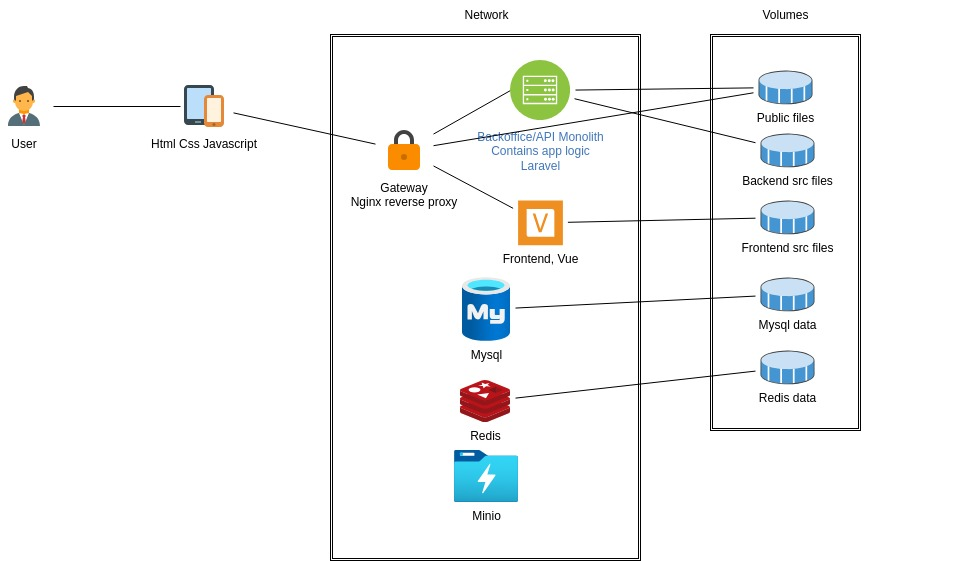

<a name="readme-top"></a>
<!--
*** Thanks to Othneil Drew with https://github.com/othneildrew/Best-README-Template/pull/73 -> Best-README-Template

[![Contributors][contributors-shield]][contributors-url]
[![Forks][forks-shield]][forks-url]
[![Stargazers][stars-shield]][stars-url]
[![Issues][issues-shield]][issues-url]
-->
[![MIT License][license-shield]][license-url]
[![LinkedIn][linkedin-shield]][linkedin-url]


<!-- PROJECT LOGO -->
<br />
<div align="center">
  <a href="https://github.com/miguel811">
    
  </a>

  <h3 align="center">Barebones</h3>

  <p align="center">
    A start guide for this project structure
    <br />
    <a href="https://github.com/othneildrew/Best-README-Template"><strong>Explore the docs »</strong></a>
    <br />
    <br />
    <a href="https://github.com/othneildrew/Best-README-Template">View Demo</a>
    ·
    <a href="https://github.com/othneildrew/Best-README-Template/issues/new?labels=bug&template=bug-report---.md">Report Bug</a>
    ·
    <a href="https://github.com/othneildrew/Best-README-Template/issues/new?labels=enhancement&template=feature-request---.md">Request Feature</a>
  </p>
</div>


<!-- TABLE OF CONTENTS -->
<details>
  <summary>Table of Contents</summary>
  <ol>
    <li>
      <a href="#about-the-project">About The Project</a>
      <ul>
        <li><a href="#built-with">Built With</a></li>
      </ul>
    </li>
    <li>
      <a href="#getting-started">Getting Started</a>
      <ul>
        <li><a href="#prerequisites">Prerequisites</a></li>
        <li><a href="#installation">Installation</a></li>
      </ul>
    </li>
    <li><a href="#usage">Usage</a></li>
    <li><a href="#roadmap">Roadmap</a></li>
    <li><a href="#contributing">Contributing</a></li>
    <li><a href="#license">License</a></li>
    <li><a href="#contact">Contact</a></li>
    <li><a href="#acknowledgments">Acknowledgments</a></li>
  </ol>
</details>


<!-- ABOUT THE PROJECT -->
## Barebones step by step

[![Product Name Screen Shot][product-screenshot]]([https://example.com](https://www.linkedin.com/in/mig-eng-solutions/))
Starting a new project, something simple but with structure, however I couldn't find what I needed ready to use online so I will put it here.

This is barebones, so someone can start coding, not prod, it will have a backoffice, a frontend and a series of services to start to build.

The compose file, the steps to create the project and all of that is in github, it can be checked there.

Starting with a Load balancer, I wanted to use vue (vuestic admin ready to go) and laravel (for a backoffice and API) but not in the same machine so that later I could change the solution arquitecture, no inner Laravel tools like Sail or Inertia just blades and Breeze, and as few external services as possible. Less dependencies, less complexity and more agility for eventual changes.

There will be 7 containers, one gateway, one Backoffice and API, mysql, redis, minio, frontend, mailpit. The load balancer/gateway( actually its just routing traffic) and a network with all services needed in separate machines that communicate freely (within the network).


There are many great README templates available on GitHub; however, I didn't find one that really suited my needs so I created this enhanced one. I want to create a README template so amazing that it'll be the last one you ever need -- I think this is it.

Here's why:
* Your time should be focused on creating something amazing. A project that solves a problem and helps others
* You shouldn't be doing the same tasks over and over like creating a README from scratch
* You should implement DRY principles to the rest of your life :smile:

Of course, no one template will serve all projects since your needs may be different. So I'll be adding more in the near future. You may also suggest changes by forking this repo and creating a pull request or opening an issue. Thanks to all the people have contributed to expanding this template!

Use the `BLANK_README.md` to get started.

<p align="right">(<a href="#readme-top">back to top</a>)</p>


### Built With

    


My requirements :
- use docker, docker compose and later kubernetes
- infrastructure services, redis, mysql, minio, mailpit.
- keep it simple, no extra tools, no extra complexity
- use laravel in the backend apis
- use laravel blades for the backoffice
- frontend with vue
- clear separation of backend and frontend projects, only api is needed and the frontend can develop without the backend
- booting the project should be clear and simple enough for anyone new or old to development, 
- a docker compose for frontend will be made available and a dev api will allow easily externalized frontend development.
- start with a monolith arquitecture but facilitate the switch to microservices when the basics are working


* [![Next][Next.js]][Next-url]
* [![React][React.js]][React-url]
* [![Vue][Vue.js]][Vue-url]
* [![Angular][Angular.io]][Angular-url]
* [![Svelte][Svelte.dev]][Svelte-url]
* [![Laravel][Laravel.com]][Laravel-url]
* [![Bootstrap][Bootstrap.com]][Bootstrap-url]
* [![JQuery][JQuery.com]][JQuery-url]

<p align="right">(<a href="#readme-top">back to top</a>)</p>


<!-- GETTING STARTED -->
## Getting Started

This is an example of how you may give instructions on setting up your project locally.
To get a local copy up and running follow these simple example steps.

### Prerequisites

This is an example of how to list things you need to use the software and how to install them.
* npm
  ```sh
  npm install npm@latest -g
  ```

### Installation

_Below is an example of how you can instruct your audience on installing and setting up your app. This template doesn't rely on any external dependencies or services._

1. Get a free API Key at [https://example.com](https://example.com)
2. Clone the repo
   ```sh
   git clone https://github.com/your_username_/Project-Name.git
   ```
3. Install NPM packages
   ```sh
   npm install
   ```
4. Enter your API in `config.js`
   ```js
   const API_KEY = 'ENTER YOUR API';
   ```

<p align="right">(<a href="#readme-top">back to top</a>)</p>


<!-- USAGE EXAMPLES -->
## Usage

Use this space to show useful examples of how a project can be used. Additional screenshots, code examples and demos work well in this space. You may also link to more resources.

_For more examples, please refer to the [Documentation](https://example.com)_

<p align="right">(<a href="#readme-top">back to top</a>)</p>


<!-- ROADMAP -->
## Roadmap

- [x] Add Changelog
- [x] Add back to top links
- [ ] Add Additional Templates w/ Examples
- [ ] Add "components" document to easily copy & paste sections of the readme
- [ ] Multi-language Support
    - [ ] Chinese
    - [ ] Spanish

See the [open issues](https://github.com/othneildrew/Best-README-Template/issues) for a full list of proposed features (and known issues).

<p align="right">(<a href="#readme-top">back to top</a>)</p>


<!-- CONTRIBUTING -->
## Contributing

Contributions are what make the open source community such an amazing place to learn, inspire, and create. Any contributions you make are **greatly appreciated**.

If you have a suggestion that would make this better, please fork the repo and create a pull request. You can also simply open an issue with the tag "enhancement".
Don't forget to give the project a star! Thanks again!

1. Fork the Project
2. Create your Feature Branch (`git checkout -b feature/AmazingFeature`)
3. Commit your Changes (`git commit -m 'Add some AmazingFeature'`)
4. Push to the Branch (`git push origin feature/AmazingFeature`)
5. Open a Pull Request

<p align="right">(<a href="#readme-top">back to top</a>)</p>


<!-- LICENSE -->
## License

Distributed under the MIT License. See `LICENSE.txt` for more information.

<p align="right">(<a href="#readme-top">back to top</a>)</p>


<!-- CONTACT -->
## Contact

Your Name - [@your_twitter](https://twitter.com/your_username) - email@example.com

Project Link: [https://github.com/your_username/repo_name](https://github.com/your_username/repo_name)

<p align="right">(<a href="#readme-top">back to top</a>)</p>


<!-- MARKDOWN LINKS & IMAGES -->
<!-- https://www.markdownguide.org/basic-syntax/#reference-style-links -->
[contributors-shield]: https://img.shields.io/github/contributors/othneildrew/Best-README-Template.svg?style=for-the-badge
[contributors-url]: https://github.com/miguel811
[forks-shield]: https://img.shields.io/github/forks/othneildrew/Best-README-Template.svg?style=for-the-badge
[forks-url]: https://github.com/othneildrew/Best-README-Template/network/members
[stars-shield]: https://img.shields.io/github/stars/othneildrew/Best-README-Template.svg?style=for-the-badge
[stars-url]: https://github.com/othneildrew/Best-README-Template/stargazers
[issues-shield]: https://img.shields.io/github/issues/othneildrew/Best-README-Template.svg?style=for-the-badge
[issues-url]: https://github.com/othneildrew/Best-README-Template/issues
[license-shield]: https://img.shields.io/github/license/othneildrew/Best-README-Template.svg?style=for-the-badge
[license-url]: https://github.com/othneildrew/Best-README-Template/blob/master/LICENSE.txt
[linkedin-shield]: https://img.shields.io/badge/-LinkedIn-black.svg?style=for-the-badge&logo=linkedin&colorB=555
[linkedin-url]: https://github.com/miguel811
[product-screenshot]: network.jpg
[Next.js]: https://img.shields.io/badge/next.js-000000?style=for-the-badge&logo=nextdotjs&logoColor=white
[Next-url]: https://nextjs.org/
[React.js]: https://img.shields.io/badge/React-20232A?style=for-the-badge&logo=react&logoColor=61DAFB
[React-url]: https://reactjs.org/
[Vue.js]: https://img.shields.io/badge/Vue.js-35495E?style=for-the-badge&logo=vuedotjs&logoColor=4FC08D
[Vue-url]: https://vuejs.org/
[Angular.io]: https://img.shields.io/badge/Angular-DD0031?style=for-the-badge&logo=angular&logoColor=white
[Angular-url]: https://angular.io/
[Svelte.dev]: https://img.shields.io/badge/Svelte-4A4A55?style=for-the-badge&logo=svelte&logoColor=FF3E00
[Svelte-url]: https://svelte.dev/
[Laravel.com]: https://img.shields.io/badge/Laravel-FF2D20?style=for-the-badge&logo=laravel&logoColor=white
[Laravel-url]: https://laravel.com
[Bootstrap.com]: https://img.shields.io/badge/Bootstrap-563D7C?style=for-the-badge&logo=bootstrap&logoColor=white
[Bootstrap-url]: https://getbootstrap.com
[JQuery.com]: https://img.shields.io/badge/jQuery-0769AD?style=for-the-badge&logo=jquery&logoColor=white
[JQuery-url]: https://jquery.com 

# barebones_setup
    
Everything is in the same internal network, at least for now, if we need to segment networks we will do it later.

I use nginx for the server in the load balancer as a reverse proxy, php-fpm in laravel, node in the frontend.

The docker images I used
- node:lts
- redis:alpine
- minio/minio:latest
- axllent/mailpit:latest
- phpmyadmin:5.1
- php:8.3-fpm
- mysql:8.0
- nginx

Then setup some volumes :
- mysql and redis need their volumes so we can restart the system without losing data
- some development folders shared with the host so its easier to develop
- public files shared between the backoffice and the loadbalancer, it will serve some files directly instead of requesting them from the backoffice

Setps to boot up the system :
- cd client_frontend
- now you may want to create the npm project with the name src, or change the folder name in client_frontend.DockerFile
- npm create vuestic@latest
- cd ../monolith
- composer create-project --prefer-dist laravel/laravel backoffice_api
- cp .env backoffice_api
- cd backoffice_api
- php artisan install:api
- composer require laravel/breeze --dev
- php artisan breeze:install
- docker ps
- docker exec -it 2abd3b0825ab(monolith id) /bin/bash
- php artisan migrate
- php artisan seed

Configure hosts to reflect the chosen url
sudo nano /etc/hosts
127.0.0.1       localhost api.something.com bk.something.com spa.something.com something.com

Now there should be two interesting apps
- something.com, which is the vue frontend.
- bk.something.com is the backoffice in blade.
- api.something.com you can use for the api in laravel
- or can use /api or /bk to setup backoffice and api, theres a nginx rule for it

Future steps :
- We will need to manage versioning. Some submodules may help here.
- Https needs to be added.
- Microservice arquitecture, authorization separating logic by business domains.
- Setup Laravel passport to manage authentication.
- Create kubernetes solution.
- Volumes need a proper solution.
- Implement CICD practices.

The authentication concerns :
- external services using the API
- end-users accessing microservices
- microservices accessing other microservices

Which can be addressed by :
- Edge authorization or, where the authorization can be handled at the gateway
- Service authorization, where the authorization is handled by each service
  
    </main>
	
  </body>
</html>

