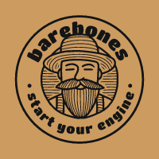

<a name="readme-top"></a>
<!--
*** Thanks to Othneil Drew with https://github.com/othneildrew/Best-README-Template/pull/73 -> Best-README-Template

[![Contributors][contributors-shield]][contributors-url]
[![Forks][forks-shield]][forks-url]
[![Stargazers][stars-shield]][stars-url]
[![Issues][issues-shield]][issues-url]
-->
[![MIT License][license-shield]][license-url]
[![LinkedIn][linkedin-shield]][linkedin-url]


<!-- PROJECT LOGO -->
<br />
<div align="center">
  <a href="https://github.com/miguel811">
    
  </a>

  <h3 align="center">Barebones</h3>

  <p align="center">
    A start guide to get coding a simple project with docker, laravel, vue and some other tools.
    <br />
    <a href="https://github.com/miguel811/barebones_setup"><strong>Explore the docs »</strong></a>
    <br />
    <br />
    <a href="https://github.com/miguel811/barebones_setup/issues/new?labels=bug&template=bug-report---.md">Report Bug</a>
    ·
    <a href="https://github.com/miguel811/barebones_setup/issues/new?labels=enhancement&template=feature-request---.md">Request Feature</a>
  </p>
</div>


<!-- TABLE OF CONTENTS -->
<details>
  <summary>Table of Contents</summary>
  <ol>
    <li>
      <a href="#barebones-step-by-step">About</a>
      <ul>
        <li><a href="#Structure">Structure</a></li>
        <li><a href="#The-requirements">The requirements</a></li>
        <li><a href="#Objectives">Objectives</a></li>
        <li><a href="#Built-With">Built With</a></li>
      </ul>
    </li>
    <li><a href="#Getting-Started">Getting Started</a>
      <ul>
        <li><a href="#Prerequisites">Prerequisites</a></li>
        <li><a href="#Installation">Installation</a></li>
        <li><a href="#installation">Installation</a></li>
      </ul>
    </li>
    <li><a href="#Roadmap">Roadmap</a></li>
    <li><a href="#License">License</a></li>
    <li><a href="#contact">Contact</a></li>
  </ol>
</details>


<!-- ABOUT THE PROJECT -->
## Barebones step by step

[![Product Name Screen Shot][product-screenshot]]([https://example.com](https://www.linkedin.com/in/mig-eng-solutions/))
Starting a new project, something simple but with structure, however I couldn't find what I needed ready to use online so I will put it here.

This is barebones, so someone can start coding, not prod, it will have a backoffice, a frontend and some of services to start to build.

The compose file, docker files, the steps to create the project and all of that is in github, it can be downloaded there.

## Structure

Starting with a Load balancer, I wanted to use vue (vuestic admin ready to go) and laravel (for a backoffice and API) but not in the same machine so that later I could change the solution arquitecture, no inner Laravel tools like Sail or Inertia just blades and Breeze, and as few external services as possible. Less dependencies, less complexity and more agility for eventual changes.

There will be 7 containers, one gateway, one Backoffice and API, mysql, redis, minio, frontend, mailpit. The load balancer/gateway( actually its just routing traffic) and a network with all services needed in separate machines that communicate freely (within the network).

Everything is in the same internal network, at least for now, if we need to segment networks we will do it later.

I use nginx for the server in the load balancer as a reverse proxy, php-fpm in laravel, node in the frontend.

<p align="right">(<a href="#readme-top">back to top</a>)</p>

<!-- ABOUT THE PROJECT -->
## The requirements
- use docker, docker compose and later kubernetes
- infrastructure services, redis, mysql, minio, mailpit.
- keep it simple, no extra tools, no extra complexity
- use laravel in the backend apis
- use laravel blades for the backoffice
- frontend with vue
- clear separation of backend and frontend projects, only api is needed and the frontend can develop without the backend
- booting the project should be clear and simple enough for anyone new or old to development, 
- a docker compose for frontend will be made available and a dev api will allow easily externalized frontend development.
- start with a monolith arquitecture but facilitate the switch to microservices when the basics are working

## Objectives
* Easy setup of a rather complex solution
* Independent of unnecessary software and external services
* Scalability : Vertical
* Arquitecture : wants to go into services and horizontal scalling
* Agility : Can adapt easily, has many options to develop features
* Development : Can be developed easily by separate teams
* Out of the box client frontend, backoffice and API
* Authentication : out of the box for the backoffice and API, client frontend needs work

<p align="right">(<a href="#readme-top">back to top</a>)</p>

## Built With
   
* [![Vue][Vue.js]][Vue-url]
* [![Laravel][Laravel.com]][Laravel-url]
* [![Docker][Docker.com]][Docker-url]
* [![Minio][Minio]][Minio-url]
* [![Redis][Redis]][Redis-url]
* [![Nginx][Nginx]][Nginx-url]
* [![Node][Node]][Node-url]
* [![Vuestic][Vuestic]][Vuestic-url]
* [![Nginx][Nginx]][Nginx-url]
* [![Redis][Redis]][Redis-url]
* [![Node.js][Node.js]][Node-url]


<p align="right">(<a href="#readme-top">back to top</a>)</p>

<!-- GETTING STARTED -->
## Getting Started

This is an example of how you may give instructions on setting up your project locally.
To get a local copy up and running follow these steps.

The docker images used here
- node:lts
- redis:alpine
- minio/minio:latest
- axllent/mailpit:latest
- phpmyadmin:5.1
- php:8.3-fpm
- mysql:8.0
- nginx

Docker uses some volumes :
- mysql and redis need their volumes so we can restart the system without losing data
- some development folders shared with the host so its easier to develop
- public files shared between the backoffice and the loadbalancer, it will serve some files directly instead of requesting them from the backoffice

## Prerequisites

This is an list of things you need to use the software and how to install them.
* npm
* docker
* php

  ```sh
  sudo apt-get install docker-ce docker-ce-cli containerd.io docker-buildx-plugin docker-compose-plugin
  sudo apt install php-cli unzip
  curl -sS https://getcomposer.org/installer -o /tmp/composer-setup.php
  sudo php /tmp/composer-setup.php --install-dir=/usr/local/bin --filename=composer
  ```

## Installation

_Below is an example of how you can setup the project._

1. Clone the repo
   ```sh
   git clone https://github.com/miguel811/barebones_setup
   cd barebones_setup
   ```
2. Setup Vue, create the Vuestic project and use the name "src", either run npm install your self or let the project run it
```sh
cd client_frontend
npm create vuestic@latest
cd src
npm install
```
3. Setup Laravel
```sh
cd ../monolith
composer create-project --prefer-dist laravel/laravel backoffice_api
cp .env backoffice_api
cd backoffice_api
php artisan install:api
composer require laravel/breeze --dev
php artisan breeze:install
```
3. Run artisan commands to initialize the DB
```sh
docker ps
docker exec -it 2abd3b0825ab(monolith id) /bin/bash
php artisan migrate
php artisan seed
```
4. Configure hosts to reflect the chosen url
```sh
sudo nano /etc/hosts
```
Add "api.something.com bk.something.com spa.something.com something.com" to the localhost config.
127.0.0.1       localhost api.something.com bk.something.com spa.something.com something.com


Now there should be two interesting apps
- something.com, which is the vue frontend.
- bk.something.com is the backoffice in blade.
- api.something.com you can use for the api in laravel
- or can use /api or /bk to setup backoffice and api, theres a nginx rule for it


<p align="right">(<a href="#readme-top">back to top</a>)</p>

<!-- ROADMAP -->
## Roadmap

- [ ] Services Arquitecture version
    - [ ] Authorization and authentication
    - [ ] Domains
    - [ ] Services apps
    - [ ] Networking rules
    - [ ] Horizontal scalling
- [ ] Versioning in submodules
- [ ] Kubernetes configuration
- [ ] Volumes proper solution
- [ ] Laravel passport
- [ ] Https
- [ ] Implement CI CD practices
- [ ] Multi-language Support
    - [ ] Chinese
    - [ ] Spanish

<p align="right">(<a href="#readme-top">back to top</a>)</p>


<!-- LICENSE -->
## License

Distributed under the MIT License. See `LICENSE.txt` for more information.

<p align="right">(<a href="#readme-top">back to top</a>)</p>


<!-- CONTACT -->
## Contact

Miguel Figueiredo miguel.8.11@gmail.com

Project Link: [https://github.com/miguel811/barebones_setup](https://github.com/miguel811/barebones_setup)

<p align="right">(<a href="#readme-top">back to top</a>)</p>


<!-- MARKDOWN LINKS & IMAGES -->
<!-- https://www.markdownguide.org/basic-syntax/#reference-style-links -->
[contributors-shield]: https://img.shields.io/github/contributors/othneildrew/Best-README-Template.svg?style=for-the-badge
[contributors-url]: https://github.com/miguel811
[forks-shield]: https://img.shields.io/github/forks/othneildrew/Best-README-Template.svg?style=for-the-badge
[forks-url]: https://github.com/othneildrew/Best-README-Template/network/members
[stars-shield]: https://img.shields.io/github/stars/othneildrew/Best-README-Template.svg?style=for-the-badge
[stars-url]: https://github.com/othneildrew/Best-README-Template/stargazers
[issues-shield]: https://img.shields.io/github/issues/othneildrew/Best-README-Template.svg?style=for-the-badge
[issues-url]: https://github.com/othneildrew/Best-README-Template/issues
[license-shield]: https://img.shields.io/github/license/othneildrew/Best-README-Template.svg?style=for-the-badge
[license-url]: https://github.com/miguel811/LICENSE.txt
[linkedin-shield]: https://img.shields.io/badge/-LinkedIn-black.svg?style=for-the-badge&logo=linkedin&colorB=555
[linkedin-url]: https://github.com/miguel811
[product-screenshot]: network.jpg
[Next.js]: https://img.shields.io/badge/next.js-000000?style=for-the-badge&logo=nextdotjs&logoColor=white
[Next-url]: https://nextjs.org/
[React.js]: https://img.shields.io/badge/React-20232A?style=for-the-badge&logo=react&logoColor=61DAFB
[React-url]: https://reactjs.org/
[Vue.js]: https://img.shields.io/badge/Vue.js-35495E?style=for-the-badge&logo=vuedotjs&logoColor=4FC08D
[Vue-url]: https://vuejs.org/
[Angular.io]: https://img.shields.io/badge/Angular-DD0031?style=for-the-badge&logo=angular&logoColor=white
[Angular-url]: https://angular.io/
[Svelte.dev]: https://img.shields.io/badge/Svelte-4A4A55?style=for-the-badge&logo=svelte&logoColor=FF3E00
[Svelte-url]: https://svelte.dev/
[Laravel.com]: https://img.shields.io/badge/Laravel-FF2D20?style=for-the-badge&logo=laravel&logoColor=white
[Laravel-url]: https://laravel.com
[Bootstrap.com]: https://img.shields.io/badge/Bootstrap-563D7C?style=for-the-badge&logo=bootstrap&logoColor=white
[Bootstrap-url]: https://getbootstrap.com
[JQuery.com]: https://img.shields.io/badge/jQuery-0769AD?style=for-the-badge&logo=jquery&logoColor=white
[JQuery-url]: https://jquery.com 
[Docker.com]: https://img.shields.io/badge/docker-%230db7ed.svg?style=for-the-badge&logo=docker&logoColor=white
[Docker-url]: https://www.docker.com

[Nginx]: https://img.shields.io/badge/nginx-%23009639.svg?style=for-the-badge&logo=nginx&logoColor=white
[Nginx-url]: https://www.nginx.com
[Redis]: https://img.shields.io/badge/redis-%23DD0031.svg?style=for-the-badge&logo=redis&logoColor=white
[Redis-url]: https://www.redis.com
[Node.js]: https://img.shields.io/badge/node.js-6DA55F?style=for-the-badge&logo=node.js&logoColor=white
[Node.js-url]: https://www.node.js
